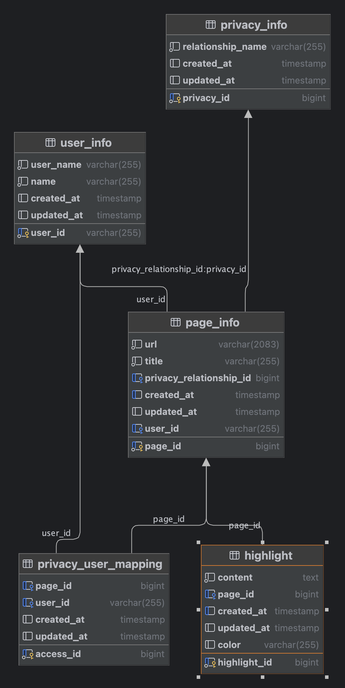

# **라이너 백엔드 개발과제(심재광)*

# 기술스택

Spring Boot 3.3.2 으로 구성하였으며 Kotlin 으로 작성되었습니다.
피드 조회를 위한 DB는 Mysql로 구성되어 있습니다.

- Spring Boot 3.3.2
- JAVA 21 Version
- My SQL Database
- Redis(Embed)
- springdoc 2.2.0(swagger)

# 상세 내용
### DB

#### user_info
인덱스 - pk
- user_id(PK) 
- user_name
- name
- created_at
- updated_at

#### page_info
인덱스 - pk, 복합인덱스(privacy_relationship_id, created_at desc)
생성일 기준 내림차순 정렬기준 때문에 인덱스 생성, user_id
- page_id(pk) 자동증가 
- url
- title
- privacy_relationship_id(fk) - privacy_info 테이블
- user_id(fk) - user_info 테이블 - index
- created_at
- updated_at

#### highlight
인덱스 - pk, 복합인덱스(page_id, created_at desc)
생성일 기준 내림차순 정렬기준 때문에 인덱스 생성
- highlight_id(pk) 자동증가 -index
- page_id(fk) - pageinfo 테이블
- content 하이라이트 내용
- color 색상
- created_at
- updated_at
- 
#### privacy_info
인덱스 - pk
- privacy_id (pk) 자동증가
- relationship_name 관계명 (PUBLIC, MENTIONED, PRIVARCY)
- created_at
- updated_at
 
#### privacy_user_mapping (페이지 별 권한 부여된 유저 매핑 테이블)
인덱스 - pk, page_id, user_id
- access_id (pk) 자동증가
- page_id (fk) - pageinfo 테이블
- user_id (fk) - user_info 테이블
- created_at
- updated_at

#### 관계
user_info - page_info 1:N
user_info - privacy_user_mapping 1:N
page_info - privacy_info 1:1
page_info - highlight 1:N
page_info - privacy_user_mapping 1:N

### Query Plan
1. 권한별 페이지 정보 조회 쿼리
   EXPLAIN

        SELECT p.page_id, p.url, p.title, p.privacy_relationship_id, p.user_id, ui.user_name, ui.name , p.created_at
        FROM page_info p
        JOIN user_info ui ON p.user_id = ui.user_id
        WHERE p.privacy_relationship_id = 1

        UNION ALL
        
        SELECT p.page_id, p.url, p.title, p.privacy_relationship_id, p.user_id, ui.user_name, ui.name , p.created_at
        FROM page_info p
        JOIN user_info ui ON p.user_id = ui.user_id
        WHERE p.privacy_relationship_id = 2
        AND EXISTS (
            SELECT 1
            FROM privacy_user_mapping pum
            WHERE pum.page_id = p.page_id
            AND pum.user_id = 'user1'
        )
        
        UNION ALL
        
        SELECT p.page_id, p.url, p.title, p.privacy_relationship_id, p.user_id, ui.user_name, ui.name , p.created_at
        FROM page_info p
        JOIN user_info ui ON p.user_id = ui.user_id
        WHERE p.privacy_relationship_id = 3
        AND ui.user_id = 'user1'
        
        ORDER BY created_at DESC
        LIMIT 5 OFFSET 0
| id | select\_type | table | partitions | type | possible\_keys | key | key\_len | ref | rows | filtered | Extra |
| :--- | :--- | :--- | :--- | :--- | :--- | :--- | :--- | :--- | :--- | :--- | :--- |
| 1 | PRIMARY | ui | null | const | PRIMARY | PRIMARY | 1022 | const | 1 | 100 | null |
| 1 | PRIMARY | p | null | ref | idx\_privacy\_relationship\_created\_at,fk\_page\_user | fk\_page\_user | 1023 | const | 3 | 57.14 | Using where |
| 2 | UNION | p | null | ref | PRIMARY,idx\_privacy\_relationship\_created\_at,fk\_page\_user | idx\_privacy\_relationship\_created\_at | 9 | const | 2 | 100 | Using where |
| 2 | UNION | ui | null | eq\_ref | PRIMARY | PRIMARY | 1022 | feed.p.user\_id | 1 | 100 | null |
| 2 | UNION | pum | null | ref | fk\_privacy\_mapping\_page,fk\_privacy\_mapping\_user | fk\_privacy\_mapping\_page | 9 | feed.p.page\_id | 1 | 60 | Using where; FirstMatch\(ui\) |
| 4 | UNION | ui | null | const | PRIMARY | PRIMARY | 1022 | const | 1 | 100 | null |
| 4 | UNION | p | null | ref | idx\_privacy\_relationship\_created\_at,fk\_page\_user | idx\_privacy\_relationship\_created\_at | 9 | const | 1 | 42.86 | Using where |
| 5 | UNION RESULT | &lt;union1,2,4&gt; | null | ALL | null | null | null | null | null | null | Using temporary; Using filesort |

2. 페이지별 최대 3개 하이라이트 조회

        EXPLAIN
           SELECT h.highlight_id,
           h.created_at,
           h.color,
           h.content,
           h.page_id
           FROM highlight h
           JOIN (
           SELECT h.highlight_id, h.page_id, h.created_at,
           ROW_NUMBER() OVER (PARTITION BY h.page_id ORDER BY h.created_at DESC) AS row_num
           FROM highlight h
           WHERE h.page_id IN (1, 2, 3, 4, 5, 6, 7)
           ) AS ranked_h ON h.highlight_id = ranked_h.highlight_id
           WHERE ranked_h.row_num <= 3
           ORDER BY h.page_id, h.created_at DESC;

   | id | select\_type | table | partitions | type | possible\_keys | key | key\_len | ref | rows | filtered | Extra |
   | :--- | :--- | :--- | :--- | :--- | :--- | :--- | :--- | :--- | :--- | :--- | :--- |
   | 1 | PRIMARY | &lt;derived2&gt; | null | ALL | null | null | null | null | 25 | 33.33 | Using where; Using temporary; Using filesort |
   | 1 | PRIMARY | h | null | eq\_ref | PRIMARY | PRIMARY | 8 | ranked\_h.highlight\_id | 1 | 100 | null |
   | 2 | DERIVED | h | null | index | idx\_pageid\_createdat\_desc | idx\_pageid\_createdat\_desc | 14 | null | 25 | 100 | Using where; Using index; Using filesort |

최초 조회시 각 페이지를 권한에 나누어 조회 한 후 UnionALL 로 합산 합니다.
하이라이트의 경우 조회된 페이지의 id들을 묶어 in 쿼리로 각 3개씩 한번에 가져온 후 코드에서 filter 합니다.

### 예외처리

기본적으로는 전역 exception handler를 설정 하였고 
일부 customException 처리를 하였습니다.

### 아쉬운 점
하이라이트는 데이터 사이즈가 크기 때문에 3개의 하이라이트 정보를 레디스 캐싱으로 이용한다면 좋을거로 생각되는데 
다 구현하지 못했습니다. 영구 캐시로 사용하고 DB에 하이라이트 정보가 업데이트 될 때마다 같이 레디스에 업데이트 해주는 방향성을 고려했습니다.

권한 부여된 사용자의 경우 자주 변하는 데이터가 아니라고 생각하여 역시 마찬가지로 캐싱하고 싶었지만 다 구현하지 못했습니다.

